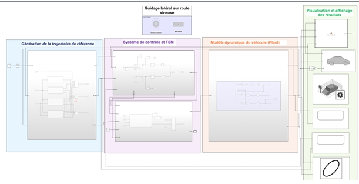
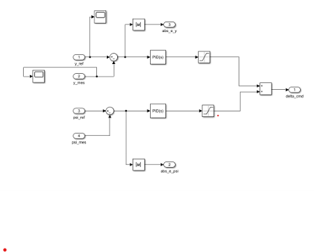
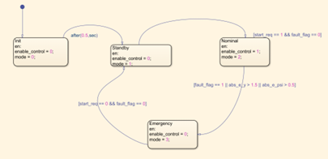
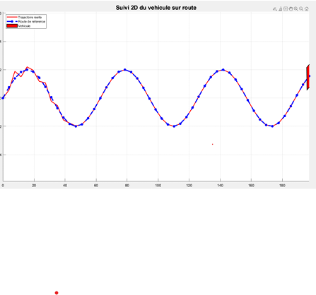
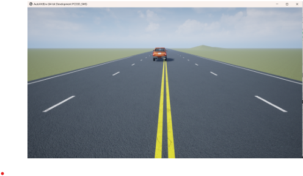

# Système de Guidage Latéral de Véhicule sous MATLAB/Simulink

## Présentation Générale

Ce projet présente la conception, la modélisation et la validation d’un système de guidage latéral de véhicule développé selon une approche Model-Based Design (MBD) sous MATLAB/Simulink.

L’objectif principal est d’assurer le suivi automatique d’une trajectoire sinueuse tout en minimisant l’erreur latérale à l’aide d’un contrôleur PID associé à une supervision sous Stateflow.

Le système développé repose sur :

- une modélisation dynamique simplifiée du véhicule,
- une génération de route sinueuse,
- un calcul des erreurs de trajectoire,
- une commande PID,
- une supervision Stateflow,
- une validation MIL / SIL / PIL,
- une visualisation 2D et 3D.

---

# Analyse et Modélisation SysML

Une modélisation SysML a été réalisée afin de structurer l’architecture globale du système ainsi que les interactions entre les différents sous-systèmes.

L’analyse SysML permet de définir :

- les exigences fonctionnelles,
- les interactions entre composants,
- les flux de données,
- les fonctions principales du système,
- la structure globale du projet.

Les diagrammes SysML réalisés comprennent :

- diagrammes des exigences,
- diagrammes de cas d’utilisation,
- diagrammes de blocs,
- diagrammes internes de blocs,
- architecture fonctionnelle du système.

  

Modélisation SysML du système de guidage latéral.

---

# Architecture Simulink du Système

L’architecture globale du modèle Simulink est organisée autour des sous-systèmes suivants :

- Environment
- Error Computation
- Controller
- Actuator
- Plant
- Sensors
- Stateflow Supervision
- Visualisation 2D/3D

Le modèle principal respecte une séparation claire entre :

- la commande,
- la dynamique du véhicule,
- la supervision,
- les scénarios de test.

  

Architecture globale du système sous Simulink.

---

# Génération de la Trajectoire de Référence

La trajectoire de référence est générée à partir d’une combinaison de fonctions sinusoïdales afin de produire une route sinueuse complexe.

La trajectoire utilisée est définie par :

y_ref(x) = A1 sin(B1 x) + A2 sin(B2 x) + A3 sin(B3 x)

Cette approche permet :

- plusieurs variations de courbure,
- des changements de direction progressifs,
- une meilleure validation du contrôleur PID.

  

Génération de la trajectoire sinueuse de référence.

---

# Modèle Dynamique du Véhicule

Le véhicule est représenté par un modèle cinématique bicyclette simplifié 2D.

Ce modèle permet de représenter :

- la position longitudinale,
- la position latérale,
- l’orientation du véhicule.

Les équations dynamiques utilisées sont :

dx/dt = v cos(ψ)

dy/dt = v sin(ψ) + dy_pert

dψ/dt = (v / L) tan(δ)

avec :

| Variable | Description |
|---|---|
| x | Position longitudinale |
| y | Position latérale |
| ψ | Orientation du véhicule |
| δ | Angle de braquage |
| v | Vitesse longitudinale |
| L | Empattement |
| dy_pert | Perturbation latérale |

---

# Hypothèses Simplificatrices

Le modèle adopté repose sur les hypothèses suivantes :

- vitesse longitudinale constante,
- mouvement plan 2D,
- faibles angles de braquage,
- absence de dynamique complexe des pneus,
- absence de transfert de charge,
- véhicule représenté par un modèle bicyclette simplifié.

Ces hypothèses permettent d’obtenir un modèle simple, stable et compatible avec une approche pédagogique MBD.

---

# Contrôleur PID

Le guidage latéral du véhicule est assuré par un contrôleur PID.

Le rôle du contrôleur est de calculer l’angle de braquage permettant de réduire :

- l’erreur latérale,
- l’erreur d’orientation.

Le contrôleur agit continuellement sur le véhicule afin d’assurer le suivi de trajectoire.

  

Implémentation du contrôleur PID sous Simulink.

---

# Supervision Stateflow

La supervision du système est réalisée à l’aide d’une machine à états Stateflow.

La logique de supervision permet :

- l’initialisation du système,
- le passage en mode opérationnel,
- la détection des défauts,
- l’activation du mode sécurité.

Les états principaux implémentés sont :

- Init
- Standby
- Nominal
- Emergency

  

Machine à états Stateflow du système.

---

# Validation MIL / SIL / PIL

Le projet intègre plusieurs niveaux de validation conformément à une approche Model-Based Design.

## MIL — Model In The Loop

Validation fonctionnelle complète du modèle Simulink.

Cette étape permet de vérifier :

- le comportement dynamique,
- le suivi de trajectoire,
- les performances du contrôleur.

---

## SIL — Software In The Loop

Validation du code généré automatiquement à partir du modèle Simulink.

Cette étape permet de comparer :

- le comportement du modèle,
- le comportement du code généré.

---

## PIL — Processor In The Loop

Validation du contrôleur compilé sur une cible processeur.

Cette étape permet :

- l’analyse du temps d’exécution,
- la vérification du comportement embarqué,
- la validation de la compatibilité temps réel.

---

# Simulation 2D

Une visualisation 2D est utilisée afin d’observer :

- la trajectoire de référence,
- la trajectoire réelle du véhicule,
- l’évolution de l’erreur latérale.

  

Suivi de trajectoire dans le plan XY.

---

# Simulation 3D

Une scène 3D est intégrée afin de visualiser le déplacement du véhicule sur une route sinueuse complexe.

La simulation 3D permet :

- une meilleure interprétation du comportement dynamique,
- une visualisation réaliste du guidage latéral,
- une démonstration complète du système.

  

Visualisation 3D du véhicule sous Simulink.

---

# Résultats Obtenus

Les simulations réalisées montrent :

- un suivi correct de trajectoire,
- une réduction significative de l’erreur latérale,
- une bonne stabilité du véhicule,
- un comportement cohérent dans différents scénarios.

Les différents tests réalisés incluent :

- scénario nominal,
- changement de consigne,
- perturbation latérale,
- défaut simplifié.

---

# Perspectives d’Amélioration

Les principales améliorations possibles sont :

- intégration d’une vitesse variable,
- ajout d’un modèle dynamique plus réaliste,
- prise en compte des effets pneumatiques,
- intégration de capteurs réels,
- validation HIL sur matériel embarqué,
- amélioration de la visualisation 3D,
- intégration d’un environnement routier plus complexe.

---
