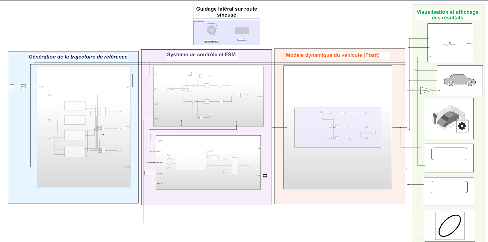
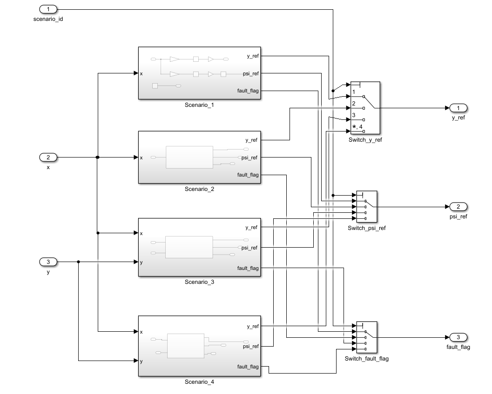
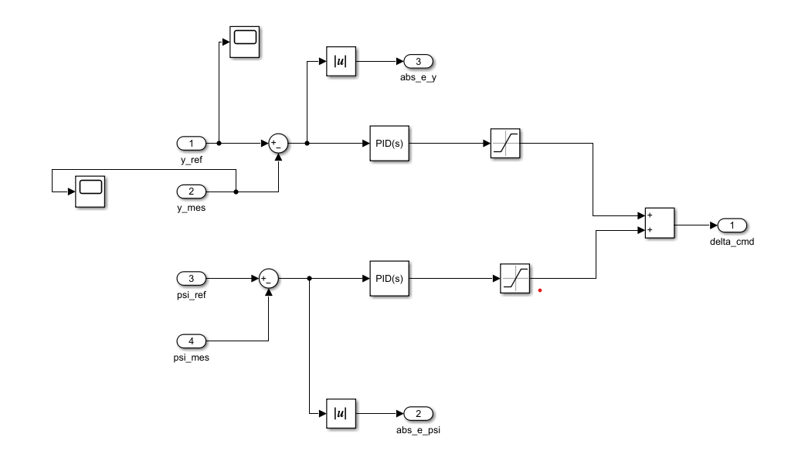
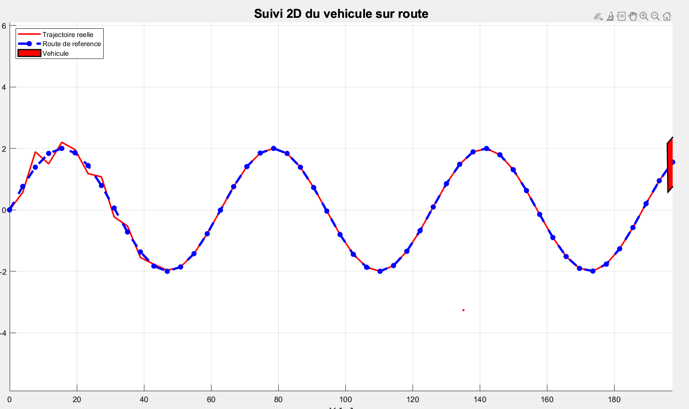
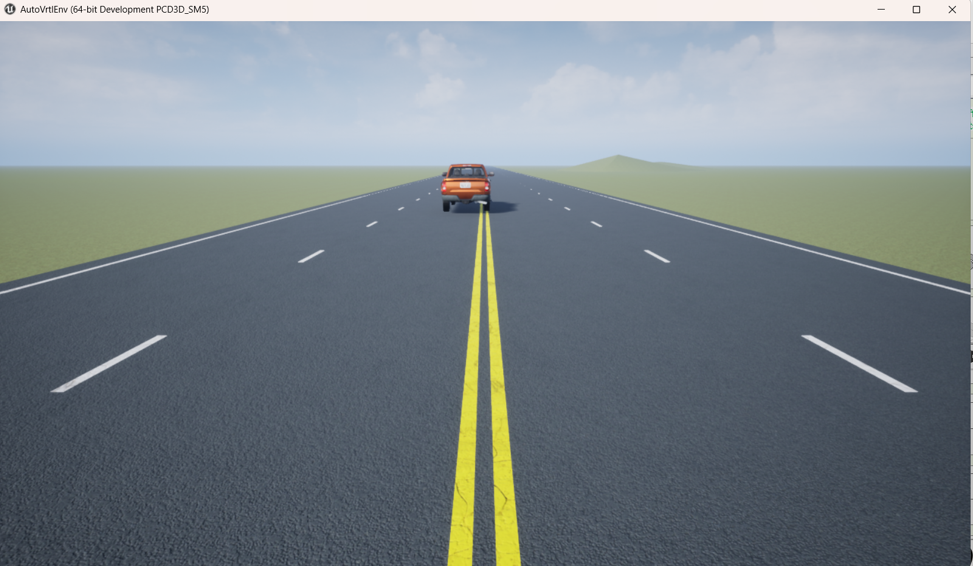

# Système LKA (Lane Keeping Assist) sous MATLAB/Simulink

## Présentation Générale

Ce projet présente la conception, la modélisation et la validation d’un système de maintien de voie automobile de type Lane Keeping Assist (LKA) développé sous MATLAB/Simulink selon une approche Model-Based Design (MBD).

L’objectif principal du système est d’assurer le guidage latéral automatique du véhicule sur une route sinueuse complexe tout en minimisant l’erreur de trajectoire à l’aide d’un contrôleur PID associé à une supervision sous Stateflow.

Le système développé intègre :

- un modèle dynamique simplifié du véhicule,
- une génération de trajectoire de référence,
- un contrôleur PID de guidage,
- une supervision par machine à états,
- des validations MIL / SIL / PIL,
- une visualisation 2D et 3D.

---

# Modélisation SysML

Une phase de modélisation SysML a été réalisée afin de structurer l’architecture globale du système et définir les interactions entre les différents sous-systèmes.

La modélisation SysML permet :

- l’analyse des exigences fonctionnelles,
- la définition des cas d’utilisation,
- l’organisation des blocs du système,
- la structuration de l’architecture globale,
- la préparation de l’implémentation Simulink.

Les diagrammes SysML réalisés comprennent :

- diagrammes des exigences,
- diagrammes de cas d’utilisation,
- diagrammes de blocs,
- diagrammes internes de blocs,
- architecture fonctionnelle du système.

---

# Architecture Simulink du Système

L’architecture globale du modèle Simulink est organisée autour de plusieurs sous-systèmes clairement séparés :

- Environment
- Error Computation
- PID Controller
- Plant
- Sensors
- Stateflow Supervision
- Visualization

Le modèle développé respecte une architecture modulaire conforme à une démarche Model-Based Design.

  

Architecture globale du système LKA sous Simulink.

---

# Génération de la Trajectoire

Le sous-système Environment permet de générer la trajectoire de référence utilisée par le contrôleur.

La route de référence est générée à partir d’une combinaison de fonctions sinusoïdales afin de produire une trajectoire sinueuse complexe.

Le bloc Environment génère :

- la position latérale de référence,
- l’orientation de référence,
- les perturbations,
- les scénarios de test.

  

Sous-système de génération de trajectoire et environnement de simulation.

---

# Modèle Dynamique du Véhicule

Le véhicule est représenté par un modèle cinématique bicyclette simplifié 2D.

Le modèle adopté permet de représenter :

- le déplacement longitudinal,
- le déplacement latéral,
- l’orientation du véhicule.

Les équations dynamiques utilisées sont :

dx/dt = v cos(ψ)

dy/dt = v sin(ψ) + dy_pert

dψ/dt = (v / L) tan(δ)

avec :

| Variable | Description |
|---|---|
| x | Position longitudinale |
| y | Position latérale |
| ψ | Orientation du véhicule |
| δ | Angle de braquage |
| v | Vitesse du véhicule |
| L | Empattement du véhicule |
| dy_pert | Perturbation latérale |

---

# Hypothèses Simplificatrices

Le modèle adopté repose sur plusieurs hypothèses simplificatrices :

- vitesse longitudinale constante,
- mouvement plan 2D,
- angles de braquage modérés,
- absence de dynamique complexe des pneus,
- absence de transfert de charge,
- modèle bicyclette simplifié.

Ces hypothèses permettent d’obtenir un modèle simple, stable et compatible avec une approche pédagogique MBD.

---

# Contrôleur PID

Le guidage latéral est assuré par un contrôleur PID chargé de minimiser l’erreur de trajectoire.

Le contrôleur calcule continuellement l’angle de braquage nécessaire afin d’assurer le suivi de la trajectoire de référence.

Le contrôleur agit principalement sur :

- l’erreur latérale,
- l’erreur d’orientation.

  

Implémentation du contrôleur PID sous Simulink.

---

# Supervision Stateflow

La supervision du système est réalisée à l’aide d’une machine à états Stateflow.

La logique de supervision permet :

- l’initialisation du système,
- l’activation du guidage,
- la gestion des défauts,
- le passage en mode sécurité.

Les états principaux implémentés sont :

- Init
- Standby
- Nominal
- Emergency

---

# Validation MIL / SIL / PIL

Le projet intègre plusieurs niveaux de validation conformément à une approche Model-Based Design.

## MIL — Model In The Loop

La validation MIL permet de valider le comportement fonctionnel complet du modèle Simulink.

Cette étape permet de vérifier :

- la dynamique du véhicule,
- le suivi de trajectoire,
- les performances du contrôleur.

---

## SIL — Software In The Loop

La validation SIL permet de comparer :

- le comportement du modèle Simulink,
- le comportement du code généré automatiquement.

Cette étape valide la cohérence entre le modèle et le code embarqué généré.

---

## PIL — Processor In The Loop

La validation PIL permet d’exécuter le contrôleur compilé sur une cible processeur.

Cette étape permet :

- l’analyse du temps d’exécution,
- la validation du comportement embarqué,
- la vérification de la compatibilité temps réel.

---

# Visualisation 2D

Une visualisation 2D est utilisée afin d’analyser :

- la trajectoire de référence,
- la trajectoire réelle du véhicule,
- l’évolution de l’erreur latérale.

  

Visualisation 2D du suivi de trajectoire.

---

# Simulation 3D

Une scène 3D est intégrée afin de visualiser le déplacement du véhicule sur une route sinueuse complexe.

La simulation 3D permet :

- une meilleure interprétation du comportement dynamique,
- une visualisation réaliste du système LKA,
- une démonstration complète du projet.

  

Simulation 3D du véhicule sous Simulink.

---

# Résultats Obtenus

Les résultats obtenus montrent :

- un suivi correct de trajectoire,
- une réduction significative de l’erreur latérale,
- une bonne stabilité du véhicule,
- un comportement cohérent dans différents scénarios.

Les scénarios testés comprennent :

- scénario nominal,
- changement de trajectoire,
- perturbation latérale,
- défaut simplifié.

---

# Logiciels et Outils Utilisés

Le projet a été développé à l’aide des outils suivants :

- MATLAB
- Simulink
- Stateflow
- Simulink 3D Animation
- SysML

---

# Perspectives d’Amélioration

Les améliorations possibles du projet incluent :

- l’intégration d’une vitesse variable,
- l’ajout d’un modèle dynamique plus réaliste,
- la prise en compte des efforts pneumatiques,
- la validation HIL sur matériel embarqué,
- l’intégration de capteurs réels,
- l’amélioration de l’environnement 3D.

---
